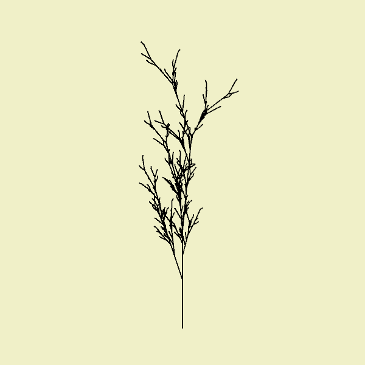

# L-System - Lindenmayer System

L-Systems are the structures and procedures created by Aristide Lindenmayer to study the growth of algae and plants, through the manipulation of symbol sequences. The sequences are generated by successive iterations of the application of substitution rules.

The computational translation of these structures was first discussed in the series *Lecture Notes in Biomathematics* with the article [Lindenmayer Systems, Fractals, and Plants](https://link.springer.com/content/pdf/10.1007/978-1-4757-1428-9.pdf) by Przemyslaw Prusinkiewcz and James Hanan (DOI: 10.1007/978-1-4757-1428-9).

> **More references:**
> 
> - [The Algorithmic Beauty of Plants](http://algorithmicbotany.org/papers/#abop) (+ various books and articles)
> - [Lindenmayer systems: Describing how things grow with strings of letters, by Christopher G Jennings](https://www.cgjennings.ca/articles/l-systems/)
> - [L-System User Notes, by Paul Bourke](http://www.paulbourke.net/fractals/lsys/)
> - [Using Lindenmayer Systems to Introduce Computer Science Concepts](https://www.russellgordon.ca/cemc/2017/lindenmayer-systems/)
> - [Wikipedia: L-system](https://en.wikipedia.org/wiki/L-system)
> - [The final section of Shiffman's Nature of Code: Chapter 8 - Fractals](https://natureofcode.com/fractals/#l-systems)

## Prerequisites

To understand the examples presented below, it is necessary to be familiar with some ideas from Python and the py5 library:

- It is possible to iterate over the chars (letters or symbols) of a string, and also it is possible to compose a new string by concatenating chars;
- The dictionary data structure can be used to store substitution rules;
- If we draw lines and modify the coordinate system at each step (with translation and rotation), we can change the line direction, and one can also return to previous points in the drawing.

### Iterating and concatenating strings

We can iterate over a string (word or phrase) with a `for` loop, that will get you the individual letters. Python still considers a single letter a string (unlike other languages it doesn't have a *char* type).

```python
>>> for letter in 'cat':
       print(letter)
c
a
t
```

We can concatenate letters to form longer strings with the `+` operator. An empty string with `''` can be concatenated with otehr strings without changing the result.

```python
>>> 'd' + 'o' + 'g'
'dog'

>>> '' + 'ha!'
'ha!'  
```

### Using dictionaries for string substitution

A dictionary is a structure that stores key-value pairs. The values can be retrieved by providing associated key. When we access the dictionary with the brackets syntax, like `dictionary[key]`, it will return the found value, but if the key is not found, a `KeyError` exception occurs.

Using the `.get(key)` method, it's possible to avoid the exception, and the special value `None` is returned. Then, if we use the form `.get(key, value_for_missing_key)`, it's possible to choose what the dictionary returns if the key is not found, like in the example below.

```python
>>> portuguese = {'maçã': 'apple', 'pêra': 'pear'}

>>> portuguese['maçã']
'apple'

>>> fruit = 'cupuaçu'  # 'cupuaçu' is not in the dictionary

>>> portuguese[fruit]   # the fruit is 'cupuaçu'
Traceback (most recent call last):
  File "<stdin>", line 1, in <module>
KeyError: 'cupuaçu'

>>> portuguese.get(fruit, "I don't know") # .get() avoids the error
"don't know"

>>> portuguese.get(fruit, fruit)  
'cupuaçu'
```

As can be observed in the example above, if we use the form `.get(key, key)`, we get the key itself if it's not found in the dictionary. This proves to be very useful when using the dictionary to indicate substitution rules: allowing the absence of the key to make the key itselg to be used without any substitution.

In the example below, we will store some letters as keys associated with a sequence of letters as a value for each of them, we will use the values to substitute the letters of the keys found in a `for` loop.

```python
vowels = {'a': 'aaaaa', 't': 'ttttt''}
word = 'What?'
new_word = ''
for letter in word:
    new_word = new_word + vowels.get(letter, letter)
print(new_word)
```

Result: **`Whaaaaattttt?`**


### Drawing lines, as if dragging a pen

To simulate the movement of a "pen" making successive lines, we can move the origin of the coordinate system using `translate()`, draw a line, and then move the origin to the end of the line. To change the orientation of the strokes, it is possible to "rotate the paper" around the origin with `rotate()`. If we save the state of the coordinate system with `push_matrix()`, we can undo subsequent transformations and then with `pop_matrix()` bringing the "pen" back to a previous point and orientation.

See below an example and the result it generates.

```python
def setup():
    size(400, 400)
    translate(200, 350)  # move the origin to a point below the middle of the screen (position 0)

    line(0, 0, 0, -100)  # a line of size 100 up
    translate(0, -100)   # move the origin to the end of the line (position 1)

    rotate(radians(45))  # rotate the paper 45 degrees

    line(0, 0, 0, -100)  # a line of size 100 up
    translate(0, -100)   # move the origin to the end of the line (position 2)

    push_matrix()        # save the coordinate system (position 2)

    rotate(radians(45))  # "rotate the paper" 45 degrees to the left

    line(0, 0, 0, -100)  # a line of size 100 up
    translate(0, -100)   # move the origin to the end of the line (position 3)

    pop_matrix()         # return to the coordinate system (position 2)

    rotate(radians(-45))  # "rotate the paper" 45 degrees to the right

    line(0, 0, 0, -100)  # a line of size 100 up
    translate(0, -100)   # move the origin to the end of the line (position 4)
```

## An initial example of L-System

Having studied the prerequisites, we can finally build an example of an L-System.

Starting from substitution rules applied to an initial phrase or sequence of symbols, called an axiom, it is then possible to produce drawings that approximate plants and fractals, with self-similarity at various scales. For this, part of the symbols are interpreted as a drawing actions, such as moving a pen forward, turning right or left by a certain angle, or going back to a previous position and heading (stored in a stack of coordinate system states).

```python
axiom = "X"
rules = {"X": "F+[[X]-X]-F[-FX]+X",
          "F": "FF"
          }

step = 10
angle = 25
interations = 4  # repetitions (turns in the application of the rules)

def setup():
    size(600, 600)
    # generating the sequence
    initial_sequence = axiom
    for i in range(interations):
        sequence = ""
        for symbol in initial_sequence:
            replacement = rules.get(symbol, symbol)
            sequence = sequence + replacement
        initial_sequence = sequence
    # drawing the sequence    
    background(240, 240, 200)
    translate(300, 500)
    for symbol in sequence:
        if symbol == "F":
            line(0, 0, 0, -step)  # draw a line
            translate(0, -step)   # move the origin
        if symbol == "+":
            rotate(radians(angle)) 
        if symbol == "-":
            rotate(radians(-angle))  
        if symbol == "[":
            push_matrix()  # save the state (position and angle)
        if symbol == "]":
            pop_matrix()   # return to the last saved state
           
           
   ```

## An interactive example   

```python
axiom = "X"
rules = {"X": "F+[[X]-X]-F[-FX]+X",
          "F": "FF"
          }
step = 10
angle = 25
interations = 4  # the substitution rules are applied 4 time
xo, yo = 300, 500

def setup():
    global sequence
    size(600, 600)
    sequence = generate_sequence(interations, axiom, rules)
    print(len(sequence))

def draw():
    background(240, 240, 200)
    translate(xo, yo)
    draw_sequence(sequence, step, angle)

def generate_sequence(num, axiom, rules):
    """
    Generate an L-System sequence from a starting sequence (axiom),
    repeating a number (num) of times the replacements described
    by a dictionary (rules);
    """
    initial_sequence = axiom
    for i in range(num):
        new_sequence = ""
        for symbol in initial_sequence:
            replacement = rules.get(symbol, symbol)
            new_sequence = new_sequence + replacement
        initial_sequence = new_sequence
    return new_sequence

def draw_sequence(symbols, step, angle):
    """
    Draw from reading a sequence of symbols according to 
    some "drawing rules" for each symbol. Size is controlled 
    by a step value, and the rotations by an angle value.
    """
    for symbol in symbols:
        if symbol == "F":
            line(0, 0, 0, -step)
            translate(0, -step)
        if symbol == "+":
            rotate(radians(angle))
        if symbol == "-":
            rotate(radians(-angle))
        if symbol == "[":
            push_matrix()
        if symbol == "]":
            pop_matrix()

def key_pressed():
    global step, angle, interations, sequence
    if key == 'z':
        step -= 1  # step = step - 1
    if key == 'x':
        step += 1
    if key == 'a':
        angle -= 1
    if key == 's':
        angle += 1
    if key == 'q':
        interations -= 1
        sequence = generate_sequence(interations, axiom, rules)
        print(len(sequence))
    if key == 'w':
        interations += 1
        sequence = generate_sequence(interations, axiom, rules)
        print(len(sequence))
```

## 3D example



If we add a `rotate_y()` instruction after each step, we gen a nice 3D structure!

```python
axiom = 'X'
rules = {
    'X': 'F+[[X]-X]-F[-FX]+X',
    'F': 'FF',
    }
passo = 5
angle = 25  # angle em graus
interations = 5

def setup():
    global sequence_resultado
    size(600, 600, P3D)
    initial_sequence = axiom
    for _ in range(interations):
        new_sequence = ""
        for symbol in initial_sequence:
            new_sequence += rules.get(symbol, symbol)
        initial_sequence = new_sequence
    print(len(sequence_resultado))

def draw():
    background(210, 210, 150)
    stroke_weight(2)
    angle = 25
    translate(width / 2, height * 0.8)
    rotate_y(frame_count / 100.0)
    for symbol in sequence_resultado:
        if symbol == 'X':   # se symbol for igual a 'X'
            pass
        elif symbol == 'F':   # else if (senão se) o symbol é F
                line(0, 0, 0, -passo)
                translate(0, -passo)
                rotate_y(radians(-angle))
        elif symbol == '+':
            rotate(radians(-angle))  # + random(-5, 5)))
        elif symbol == '-':
            rotate(radians(+angle))  # + random(-5, 5)))
        elif symbol == '[':
            push_matrix()
        elif symbol == ']':
            pop_matrix()
```


